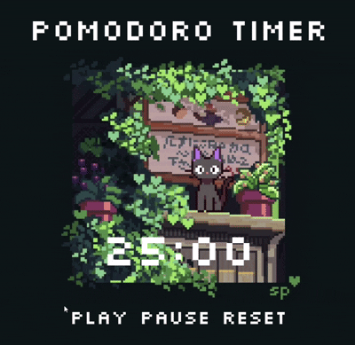

<a id="readme-top"></a>
<!-- PROJECT LOGO -->
<br />
<div align="center">
  <a href="https://github.com/github_username/repo_name">
    
  </a>

<h3 align="center">Day 1: Pomodoro Timer ⏱️</h3>

  <p align="center">
    Pixel Art Style Pomodoro Timer built with HTML, CSS, and JavaScript.
    <br />
    <a href="https://github.com/yourusername/pomodoro-app"><strong>Explore the Code »</strong></a>
    <br />
    <br />
    <a href="https://your-demo-video-link.com">View Demo</a>
    ·
    <a href="https://github.com/yourusername/pomodoro-app/issues">Report Bug</a>
    ·
    <a href="https://github.com/yourusername/pomodoro-app/issues">Request Feature</a>
  </p>
</div>


<!-- TABLE OF CONTENTS -->
<details>
  <summary>Table of Contents</summary>
  <ol>
    <li>
      <a href="#about-the-project">About The Project</a>
      <ul>
        <li><a href="#built-with">Built With</a></li>
      </ul>
    </li>
    <li>
      <a href="#getting-started">Getting Started</a>
    </li>
    <li><a href="#usage">Usage</a></li>
    <li><a href="#acknowledgments">Acknowledgments</a></li>
  </ol>
</details>


<!-- ABOUT THE PROJECT -->
## About The Project
<div align="center">



</div>


This is **Day 1** of my **30 Days 30 Projects** challenge — a simple Pomodoro timer that helps boost focus and productivity by breaking work into intervals, typically 25 minutes of work followed by a 5-minute break.

Features:
- Start, Pause, and Reset buttons
- Responsive layout
- Clean UI


<p align="right">(<a href="#readme-top">back to top</a>)</p>

### Built With

* HTML
* CSS
* JavaScript

<p align="right">(<a href="#readme-top">back to top</a>)</p>


<!-- GETTING STARTED -->
## Getting Started

To run the project locally:

### Installation

1. Clone the repo:
   ```sh
   git clone https://github.com/yourusername/pomodoro-app.git
2. Open index.html in your browser
No installations or dependencies needed — it's 100% frontend.

<p align="right">(<a href="#readme-top">back to top</a>)</p>


<!-- USAGE EXAMPLES -->
## Usage

Click Play to start the 25-minute timer

Pause to stop and resume when needed

Reset to start a fresh session

<p align="right">(<a href="#readme-top">back to top</a>)</p>

<!-- ACKNOWLEDGMENTS -->
## Acknowledgments

Pixel art background image is art done by <a href="https://www.instagram.com/spilledpixel/" target="_blank">Spilled Pixel</a>

<p align="right">(<a href="#readme-top">back to top</a>)</p>


<!-- MARKDOWN LINKS & IMAGES -->
[screenshot]: assets/pomodoro-app.png
[demo-video]: assets/pomodoro-app-demo.gif
